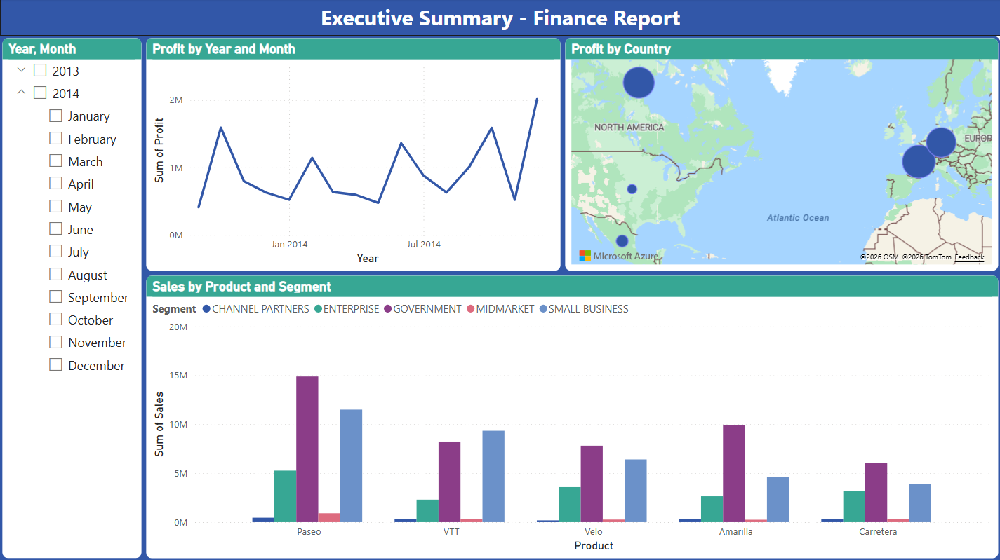

# Executive Sales Intelligence

### Power BI Business Intelligence Dashboard

Transforming raw financial data into an **interactive executive analytics dashboard** using **Power BI, DAX, and modern data modeling techniques**.

This project demonstrates how business intelligence tools can convert spreadsheet-based financial data into **actionable insights for strategic decision-making**.

## Business Problem

Many organizations store operational and financial information in **Excel-based reporting systems**, which makes it difficult to quickly answer important business questions such as:

* Which regions generate the **highest revenue and profit**?
* Which product segments contribute the **most to overall profitability**?
* How do **sales trends evolve over time**?
* Where are the **largest opportunities for growth**?

Without a centralized analytics solution, leadership teams often rely on **manual analysis and static reports**, limiting their ability to make timely decisions.

This project demonstrates how a **Power BI executive dashboard** can solve this problem by transforming raw data into **interactive, decision-ready insights**.

---

## Solution Overview

The solution builds an **end-to-end business intelligence report** using Power BI that enables stakeholders to explore financial performance across **time, geography, and product segments**.

The dashboard provides:

* **Interactive filtering and slicing**
* **Dynamic KPI monitoring**
* **Visual analysis of sales and profitability**
* **Executive-level performance insights**

The report architecture follows modern BI practices including:

* Data transformation with **Power Query**
* Analytical modeling using **DAX**
* Interactive visualization within **Power BI Desktop**
* Cloud sharing through **Power BI Service**

---

## Key Business Questions Answered

The dashboard enables stakeholders to answer several strategic questions:

* Which **month and year produced the highest profit?**
* Which **countries or regions contribute the most revenue?**
* Which **product segments generate the highest margins?**
* How do **sales and profit trends change over time?**
* What patterns emerge when filtering by **region, segment, or product category**?

These insights allow business leaders to identify **growth opportunities, high-performing markets, and potential areas for optimization**.

---

## Dataset

The project uses the **Financial Sample dataset**, a widely used Power BI dataset containing transactional financial data.

### Key Fields

| Field         | Description       |
| ------------- | ----------------- |
| Date          | Transaction date  |
| Country       | Sales region      |
| Product       | Product name      |
| Segment       | Market segment    |
| Sales         | Total revenue     |
| Profit        | Net profit        |
| Discount Band | Discount category |

The dataset provides **multi-dimensional financial performance metrics**, making it suitable for demonstrating **interactive BI reporting**.

---

## Tools & Technologies

| Technology                          | Purpose                              |
| ----------------------------------- | ------------------------------------ |
| **Power BI Desktop**                | Data modeling and dashboard creation |
| **Power Query**                     | Data cleaning and transformation     |
| **DAX (Data Analysis Expressions)** | Analytical calculations and KPIs     |
| **Microsoft Excel**                 | Source dataset                       |
| **Power BI Service**                | Cloud publishing and report sharing  |

---

## Data Pipeline

The project follows a typical **Business Intelligence development workflow**.

### 1. Data Ingestion

The Excel dataset is imported into Power BI using the **Navigator interface**, enabling direct connection to the financial data.

### 2. Data Transformation

Data preparation is performed in **Power Query**, including:

* Validating column data types
* Ensuring consistent currency and numeric formats
* Preparing fields for analysis

Proper transformation ensures the dataset is **clean, structured, and analytics-ready**.

### 3. Data Modeling

A semantic model is built using **Power BI's Model View**, including:

* Creation of a **Calendar table using DAX**
* Establishing relationships between date and transactional data
* Structuring the model for efficient reporting

This modeling step ensures accurate time-based analysis.

### 4. Report Development

The interactive dashboard is created using Power BI visualizations and slicers, allowing users to explore financial performance dynamically.

### 5. Deployment

The report is published to **Power BI Service**, enabling:

* Secure cloud access
* Interactive sharing with stakeholders
* Organization-wide data exploration

---

## Dashboard Features

### Profit Trend Analysis

Tracks profit performance across months and years, allowing stakeholders to identify **seasonal patterns and high-performing periods**.

---

### Geographic Revenue Analysis

Displays sales performance by **country and region**, highlighting the markets that generate the highest revenue.

---

### Product Segment Performance

Compares profitability across product segments, helping decision-makers determine where to **focus investment and sales efforts**.

---

### Interactive Filtering

Users can dynamically filter results by **time period, region, or product category**, enabling deeper exploration of performance trends.

---

## Key Insights

The dashboard reveals several valuable analytical perspectives:

* Identification of **top-performing sales periods**
* Visibility into **regional market contribution**
* Comparison of **segment-level profitability**
* Ability to explore trends through **interactive filtering**

These insights enable organizations to move from **static reporting to interactive business intelligence**.

---

## Live Dashboard

View the interactive report:

**Power BI Dashboard:**
[https://app.powerbi.com/view?r=eyJrIjoiZTQ0NTM4ZTQtYjRjMi00NDcxLWE5YzgtODZiOWJiZWRiM2ZhIiwidCI6ImRmODY3OWNkLWE4MGUtNDVkOC05OWFjLWM4M2VkN2ZmOTVhMCJ9](https://app.powerbi.com/view?r=eyJrIjoiZTQ0NTM4ZTQtYjRjMi00NDcxLWE5YzgtODZiOWJiZWRiM2ZhIiwidCI6ImRmODY3OWNkLWE4MGUtNDVkOC05OWFjLWM4M2VkN2ZmOTVhMCJ9)

---